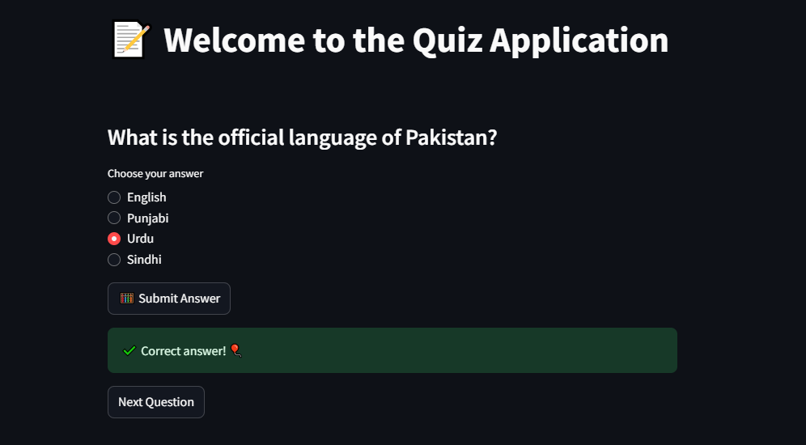

# Streamlit Quiz Application

Welcome to the **Streamlit Quiz Application**! This is a simple, interactive quiz app built using Streamlit, a popular Python library for creating web applications. The app presents users with multiple-choice questions about Pakistan and provides instant feedback on their answers.

## Live App
https://modernquizapp.streamlit.app/

## Features

- **Randomized Questions**: Each time the app runs, a random question is selected from a predefined list.
- **Interactive Interface**: Users can select an answer using radio buttons and submit their response.
- **Instant Feedback**: The app immediately informs users whether their answer is correct or incorrect.
- **Next Question**: After submitting an answer, users can proceed to the next question with a single click.
- **Balloon Animation**: A fun balloon animation is displayed when the user answers a question correctly.

## How to Use

1. **Install Streamlit**:
   If you don't have Streamlit installed, you can install it using pip:
   ```bash
   uv add streamlit
   ```

2. **Run the Application**:
   Navigate to the project directory and run the following command:
   ```bash
   streamlit run quiz_app.py
   ```

3. **Take the Quiz**:
   - The app will display a multiple-choice question.
   - Select your answer using the radio buttons.
   - Click the **Submit Answer** button to check your answer.
   - If your answer is correct, you'll see a success message and a balloon animation.
   - If your answer is incorrect, the correct answer will be displayed.
   - Click the **Next Question** button to proceed to the next question.

## Code Structure

The project consists of a single Python script (`quiz_app.py`) with the following structure:

- **Questions**: A list of dictionaries containing the quiz questions, options, and correct answers.
- **Streamlit UI**: The app uses Streamlit's `st.title`, `st.subheader`, `st.radio`, and `st.button` functions to create an interactive user interface.
- **Session State**: The app uses Streamlit's session state to manage the current question, selected answer, and result display.

## Example Questions

Here are some examples of the questions included in the quiz:

1. **What is the capital of Pakistan?**
   - Options: Karachi, Islamabad, Lahore, Quetta
   - Answer: Islamabad

2. **Who is the founder of Pakistan?**
   - Options: Muhammad Ali Jinnah, Quaid-e-Azam, Allama Iqbal, Sir Syed Ahmed Khan
   - Answer: Muhammad Ali Jinnah

3. **What is the largest city of Pakistan?**
   - Options: Lahore, Islamabad, Karachi, Faisalabad
   - Answer: Karachi

## Customization

You can easily customize the quiz by adding or modifying questions in the `questions` list. Each question should follow this format:

```python
{
    "question": "Your question here",
    "options": ["Option 1", "Option 2", "Option 3", "Option 4"],
    "answer": "Correct Answer"
}
```

## Requirements

- Python 3.6 or higher
- Streamlit (`uv add streamlit`)

## Screenshots

  
*Example of the quiz app in action.*

## Contributing

If you'd like to contribute to this project, feel free to fork the repository and submit a pull request. You can also open an issue to report bugs or suggest new features.
